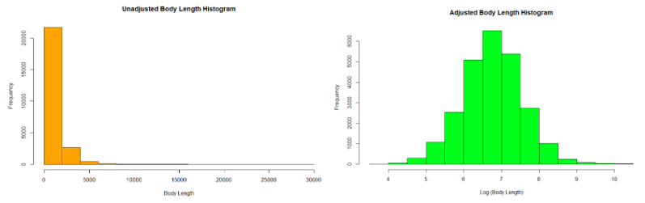

# StackExchange-Analysis
--Joel Hensel, Mark Tenzer, Devan Visvalingam, Ada Zhu

The goal of this analysis is to answer key questions that would help various StackExchange users interact more positively with the platform. 

To begin with, users in this analysis can be categorized into three roles: 
* Those who are seeking knowledge (the “Questioner”)
* Those who are providing knowledge (the “Answerer”)
* Those governing the platform (the “Moderator”)

The analysis sought answers to the following questions:
* For the Questioner, “will my question get an answer at all?” 
* For the Questioner, “how many answers will my question get?” 
* For the Questioner, “will my question get an accepted answer?” 
* For the Answerer, “how do I have my answer get the highest score?”

*Each of these questions is founded on the notion that if the user knew of certain variables that predicted the outcomes, they could manipulate their posts in order to better achieve their outcomes.*

# Acquiring the Data and Pre-Processing Methods
On StackExchange Data Explorer, we select a couple variables out of around a hundred variables to serve as candidate regressors based on the four business questions we sought to answer. While unlimited computing power, time, and memory would motivate the collection of each and every attribute available for analysis (after which we could employ statistical techniques to pare down the list methodically), we felt it worthwhile to apply judgment and pull data only with good cause.

Using both SQL in the acquisition of the data, as well as R in the creation of a dataframe, many of the candidate regressor variables were transformed to facilitate better modeling. Many user attributes, such as the profile picture and the website link, could not possibly influence response variables, as these data are qualitative and not at all categorical. However, we suspected that profile completion may have influence. Therefore, instead of acquiring these data as is, we simply transformed them into binary attributes that indicated whether the data was null or not. Several attributes came with the value of “NA” when in reality the value was 0. In order to make these attributes consistently numeric, these NAs were converted to 0s. 

Further transformations were required of certain regressor variables due to the distribution of the raw data. One example is length of the post’s body and also title. The vast majority of posts had body length under 2,500 characters for instance, but some outlier posts had lengths that exceeded 20,000. For both of these regressors, taking the log provided a much more suitable and normal distribution. 

 
# As an Answerer, How Do I Have My Answer Get the Highest Score?	

Looking at the distribution of each variable, we noticed that some values such as the scores, length, and user views were extremely skewed, so we decided to include the log of these variables in the model instead, because they have distributions closer to normal distribution after transformation. We then split the dataset into training and testing with a ratio of 0.8 to 0.2. This split allows us to test our data later using dataset that’s not included when building the model, estimating the accuracy of the model on unseen data in an unbiased manner. We ran a regression on all 9 regressors using the training data and got an Adjusted R2 of 0.3133, implying that around 31 percent of the variability in the model can be explained by the regression. We also applied boxcox function, but the transformation suggested does not seem to provide a better model, with smaller R2 .   

From the Cook’s distance plot, we could see that most of the data points fall between 0 and 0.01, with only a few influential points spreading out. Considering the large size of our dataset, we decided to keep these points in the model to avoid losing any important information.

We then ran step regression to check if the model could be improved by model selection. The function stepAIC removed variable hasProfileImg, which seemed reasonable since we would assume most of the users that have profile image linked to their account also have “aboutMe” in the profile, and more variability can be explained by “aboutMe”. The VIFs of each of the coefficients in this reduced model are all relatively small, implying that there was no multicollinearity among variables. Our potential model was now: 

log(score) = 2.872e+00 + 2.807e-02 * length + 2.236e-04 * duration   + 3.355e-02 * questionView 
 -1.213e-04 * TitleLen  -8.710e-03 * HasAboutMe + 3.267e-02 * Reputation 
  -2.126e-02 * UserViews  -1.309e-03 * TagCount
	As shown in the model, factors such as the length of the answer, duration, amount of question views, users’ reputation had positive impacts, while the rest seemed to have negative impacts on scores that answerers receive. 

For answerers to earn the highest scores, not only do they have to provide great answers, but also be selective in which questions they choose to respond to. Unlike questions, longer answers tended to yield positive outcomes for answerers. However, more attributes pertaining to the question itself seemed to influence score. For example, questions with shorter titles, more views, and less tags tended to produce answers with higher scores. Also, user attributes of the answerer, such as Reputation and Views, influenced the score, regardless of its content.

